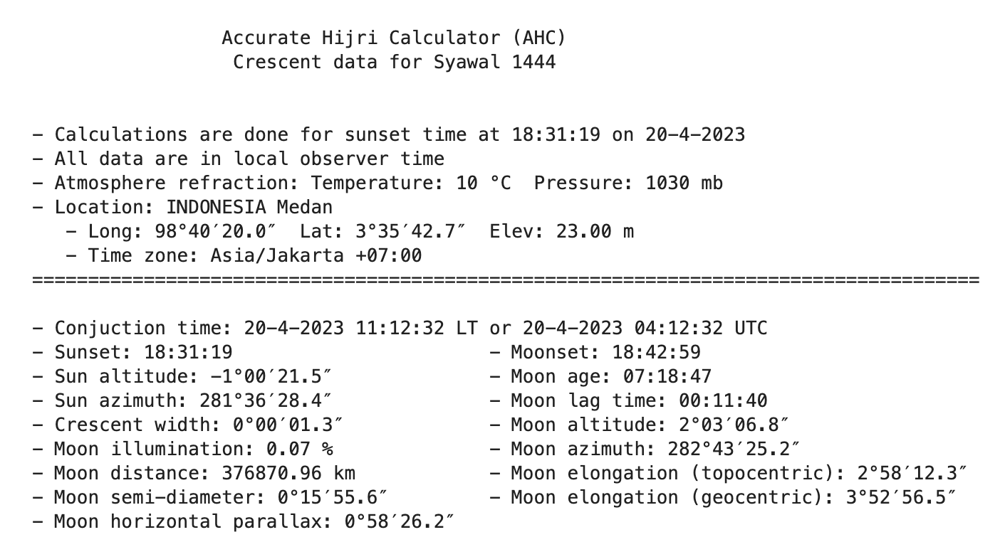
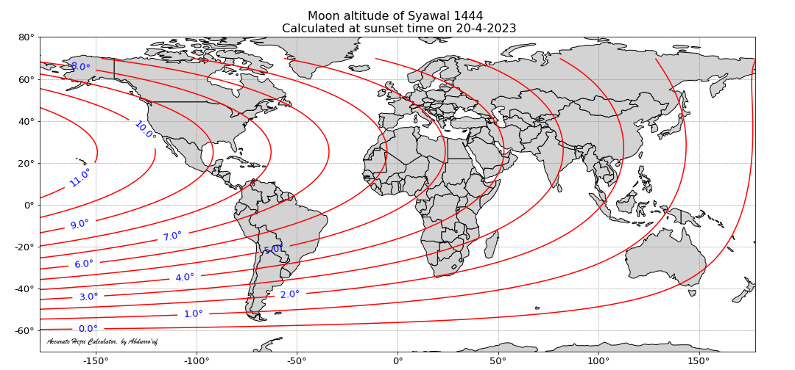
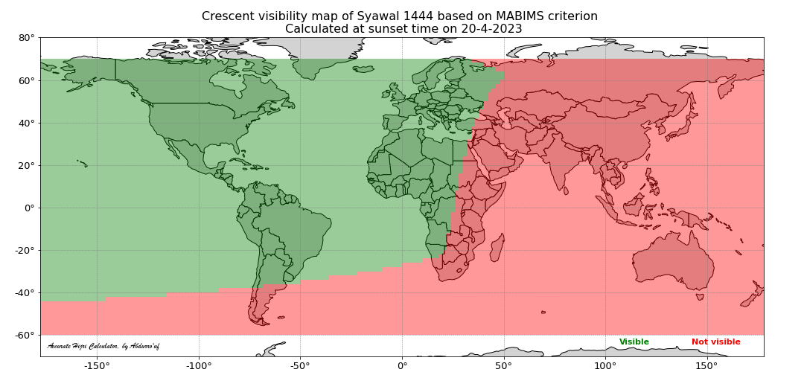
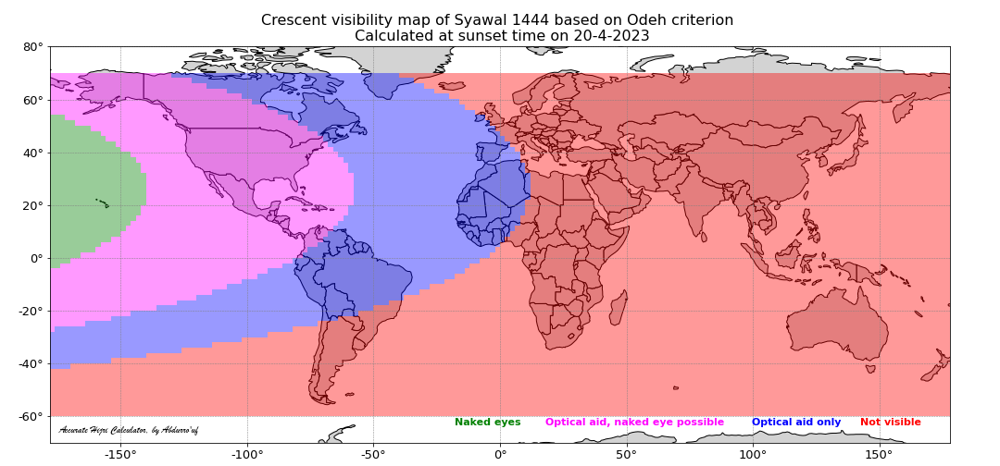
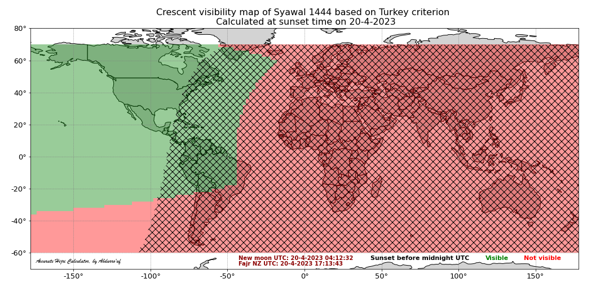

# Accurate Hijri Calculator (AHC)


Accurate Hijri Calculator (AHC) is a software for calculating the position and visibility of the crescent moon at the sunset time after the conjunction (ijtima'/new moon phase) that marks the beginning of a new month in the Islamic lunar calendar (Hijri calendar). This tool is intended for helping moslem people in estimating the start of a new Hijri month, making a calendar for coming years, comparing among the criteria of Hijri calendar, as well as educating people about the current issues regarding the Hijri calendar. This software incorporates various current crescent visibility criteria adopted by moslem organizations around the world. AHC was firt developed in 2012 and was published at [link](https://fi.ub.ac.id/kemahasiswaan-alumni/keorganisasian/tim-astronomi-fisika/accurate-hijri-calculator-2-2/). While the first version of AHC was built with GUI support from Delphi, now it is transformed into fully python package and can be executed on terminal (linux and windows) without GUI display. One can run AHC on [Jupyter notebook](https://jupyter.org/) to get GUI experience as shown in the example tutorial [here](https://github.com/accuhijri/ahc/blob/main/examples/ahc_1444_syawal.ipynb).         

## Developer
This software is developed and maintained by [Abdurro'uf](https://aabdurrouf.github.io/), who is currently working as an astronomy researcher at the Department of Physics and Astronomy, The Johns Hopkins University and The Space Telescope Science Institute (STScI). 
 
## Installation
To install AHC, first clone AHC package into your desired directory (in your local machine) and then enter `ahc` directory and install. You can do it using the following commands 

```
git clone https://github.com/accuhijri/ahc.git
cd ahc
python -m pip install .
```

To use AHC, you need to put `de421.bsp` file in wherever directory you are working. This file is included in the `ahc` package and can be copied to your working directory. An alternative way would be to download this file from NASA website using the following command

```
wget https://ssd.jpl.nasa.gov/ftp/eph/planets/bsp/de421.bsp
```

Last but not least, you need to install [geopandas](https://geopandas.org/en/stable/) if you intend to produce crescent visibility map with AHC. To install it, you can use the following command, assuming you have `conda` installed in your machine.

```
conda install -c conda-forge geopandas
```

## Some features

### 1. Calculate the data of hilal (i.e., crescent)
```ruby
from ahc.hilal import hilal
hijri_year = 1444
hijri_month = 10        # syawal is 10th month in Hijri calendar
calculate_maps = True 
plus_1day = True
hl = hilal(hijri_year=hijri_year, hijri_month=hijri_month, calculate_maps=calculate_maps, plus_1day=plus_1day)
```

```ruby
latitude = 3.595196
longitude = 98.672223
elevation = 23.0
time_zone_str = 'Asia/Jakarta'
loc_name = 'INDONESIA Medan'
hl.calculate_hilal_data(latitude, longitude, elevation, time_zone_str, loc_name=loc_name, delta_day=0)
```


### 2. Get maps of moon properties 
This include maps of moon altitude, longitude (topocentric and geocentric), moon-sun altitude difference (arc of vision; ARCV), moon width, and moon age. Below is an example line of script to get the map of moon altitude.
```ruby
hl.map_moon_altitude()
```


### 3. Get map of crescent vibility based on various criteria
There are 6 criteria that are currently available in AHC: MABIMS, Odeh, Wujudul Hilal, Turkey, Danjon, and Itjima Qobla Ghurub.

#### 3.1. Crescent vibility map based on MABIMS criteria
This citeria is currently (as of 2023) used by the goverments of Indonesia, Malaysia, Singapore, and Brunei Darussalam.
```ruby
hl.map_hilal_visibility('MABIMS')
```


#### 3.2. Crescent visibility map based on Odeh criteria
This criteria is proposed by Mohammad Odeh in his 2016 [paper](https://www.researchgate.net/publication/225099773_New_Criterion_for_Lunar_Crescent_Visibility) published in the Journal of Experimantal Astronomy.
```ruby 
hl.map_hilal_visibility('Odeh')
```


#### 3.3. Crescent visibility map based on Terkey criteria
This criteria is proposed by the International Hijri Calendar Union Congress in Istanbul in 2016 to be the criteria for the unified Hijri calendar.
```ruby
hl.map_hilal_visibility('Turkey')
```

